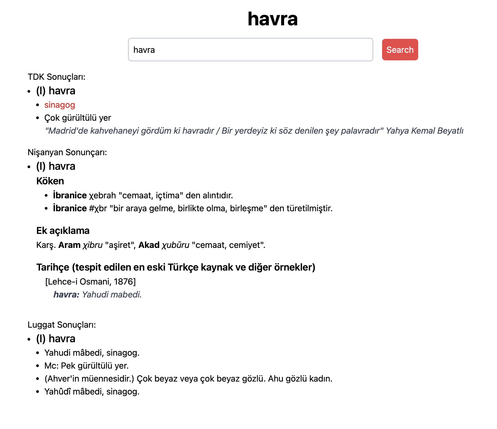

# Enes Sözlük

A convenient web tool for Turkish speakers that combines multiple dictionaries.

## The Dictionaries

- [TDK - General Turkish Dictionary](https://sozluk.gov.tr/)
- [Nişanyan Sözlük - Etymological Dictionary](https://www.nisanyansozluk.com/)
- [Kubbealtı Lugatı - İlhan Ayverdi](https://www.lugatim.com/)
- [Luggat - Ottoman Turkish Dictionary](https://www.luggat.com/)
- [Benzer Kelimeler - Similar Words](https://www.benzerkelimeler.com/)
- Kâfiyeli Kelimeler - Rhyming Words

# Try it out

[enessozluk.pages.dev](https://enessozluk.pages.dev/)


## Static Site Generator (Node.js)

```shell
bun build.server
```
