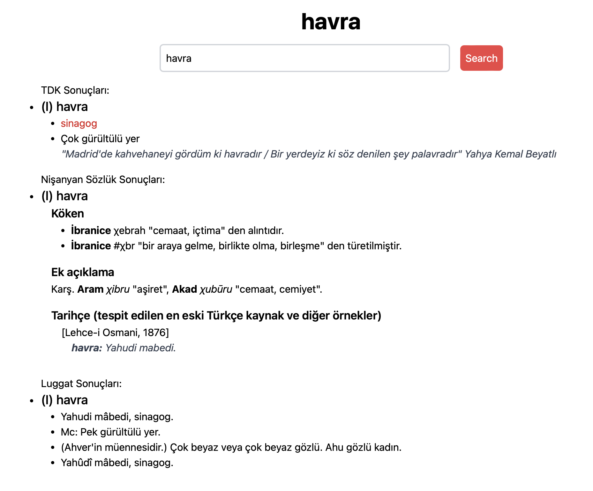

# Enes Sözlük

A convenient web tool for Turkish speakers that combines multiple dictionaries.

## The Dictionaries

- [TDK - General Turkish Dictionary](https://sozluk.gov.tr/)
- [NişanyanSözlük - Etymological Dictionary](https://www.nisanyansozluk.com/)
- [Luggat - Ottoman Turkish Dictionary](https://www.luggat.com/)

# Try it out

[enessozluk.pages.dev](https://enessozluk.pages.dev/)

